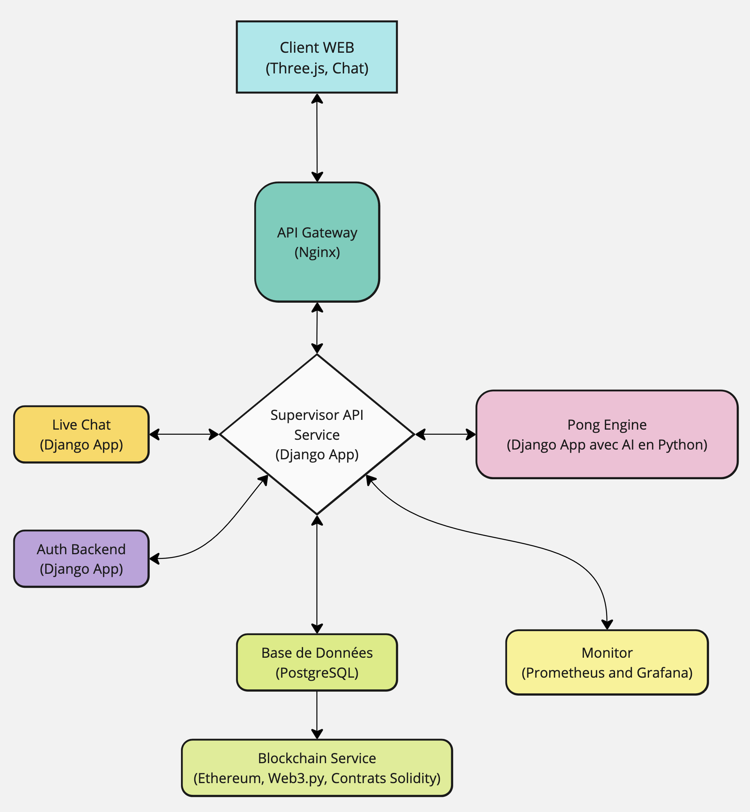

# 🏓 ft_transcendence 🏓

## Introduction

ft_transcendence est un projet web complexe où les utilisateurs peuvent jouer au jeu Pong contre d'autres joueurs en temps réel, avec une interface utilisateur en 3D et un chat en direct. Le backend est géré entièrement par Django et l'application utilise diverses technologies modernes pour offrir une expérience utilisateur riche.

## Architecture du Projet

L'architecture du projet est conçue pour être modulaire et scalable, en utilisant des conteneurs Docker pour chaque composant afin de simplifier le déploiement et la gestion.

### Diagramme de l'Architecture



### Description des Composants

1. **Client WEB (Frontend)**:
   - **Technologies**: Vanilla JavaScript, Bootstrap, Three.js
   - **Description**: Interface utilisateur pour le chat en direct 3D et le jeu Pong. Utilise Three.js pour le rendu 3D. Communique directement avec le Pong Engine pour recevoir l'état du jeu en temps réel.

2. **API Gateway (Nginx)**:
   - **Description**: Point d'entrée unique pour les requêtes des clients, gère et achemine les requêtes vers les services appropriés.

3. **Service d'Authentification (Django App)**:
   - **Description**: Gère l'inscription, la connexion et la gestion des utilisateurs.

4. **Supervisor API Service (Django App)**:
   - **Description**: Gère les fonctionnalités spécifiques de supervision et de gestion du jeu.

5. **Pong Engine (AI) (Django App avec AI en Python)**:
   - **Description**: Composant AI pour le jeu Pong. Envoie l'état du jeu au Client WEB pour le support multi-joueurs en temps réel.

6. **Base de Données (PostgreSQL)**:
   - **Description**: Gestion du stockage des données et interactions avec la blockchavn.

7. **Blockchain Service (Ethereum, Web3.py, Contrats Solidity)**:
   - **Description**: Stocke les scores des tournois de Pong sur la blockchain.

8. **Live Chat (Django App avec Django Channels)**:
   - **Description**: Gère la messagerie en temps réel entre les utilisateurs.

### Arborescence des Dossiers

```
ft_transcendence/
│
├── srcs/
│   ├── client_web/
│   │   ├── public/
│   │   └── src/v
│   │       ├── js/
│   │       ├── css/
│   │       └── index.html
│   │
│   ├── api_gateway/
│   │   ├── nginx.conf
│   │   └── Dockerfile
│   │
│   ├── backend/
│   │   ├── Dockerfile
│   │   ├── manage.py
│   │   ├── requirements.txt
│   │   ├── myproject/
│   │   │   ├── __init__.py
│   │   │   ├── settings.py
│   │   │   ├── urls.py
│   │   │   ├── wsgi.py
│   │   │   └── asgi.py
│   │   ├── authentication/
│   │   │   ├── __init__.py
│   │   │   ├── models.py
│   │   │   ├── views.py
│   │   │   ├── urls.py
│   │   │   └── serializers.py
│   │   ├── supervision/
│   │   │   ├── __init__.py
│   │   │   ├── models.py
│   │   │   ├── views.py
│   │   │   ├── urls.py
│   │   │   └── serializers.py
│   │   ├── pong_engine/
│   │   │   ├── __init__.py
│   │   │   ├── ai.py
│   │   │   ├── game_state.py
│   │   │   ├── views.py
│   │   │   ├── urls.py
│   │   │   └── serializers.py
│   │   ├── chat/
│   │   │   ├── __init__.py
│   │   │   ├── consumers.py
│   │   │   ├── routing.py
│   │   │   ├── views.py
│   │   │   ├── urls.py
│   │   │   └── serializers.py
│   │   ├── blockchain/
│   │   │   ├── contracts/
│   │   │   │   └── PongScore.sol
│   │   │   ├── scripts/
│   │   │   │   └── interact.py
│   │   │   ├── views.py
│   │   │   ├── urls.py
│   │   │   └── serializers.py
│   │   └── db.sqlite3
│   │
│   ├── database/
│   │   └── Dockerfile
│   │
│   └── docker-compose.yml
│
└── README.md
```

### Technologies Utilisées

1. **Frontend**:
   - **Three.js** : Pour le rendu 3D.
   - **Vanilla JavaScript et Bootstrap** : Pour la structure et le design de l'interface utilisateur.

2. **Backend**:
   - **Django** : Utilisé comme framework principal pour tout le backend.

3. **Base de Données**:
   - **PostgreSQL** : Utilisé avec Django ORM pour la gestion des données.

4. **Blockchain**:
   - **Ethereum** : Pour stocker les scores des tournois.
   - **Solidity** : Pour le développement de smart contracts.
   - **Web3.py** : Pour interagir avec Ethereum depuis Django.

5. **Chat en Direct**:
   - **Django Channels** : Pour implémenter des fonctionnalités de chat en temps réel.

### Déploiement

Le projet utilise Docker et Docker Compose pour le déploiement. Toutes les opérations courantes, telles que la construction des images, le démarrage et l'arrêt des conteneurs, sont gérées via un Makefile.

### Utilisation du Makefile

Le Makefile simplifie les opérations courantes du projet. Vous pouvez exécuter les commandes suivantes pour gérer votre environnement Docker.


### Exécution du Projet

Pour démarrer le projet, vous pouvez utiliser les commandes suivantes avec le Makefile :

- **Pour construire les images Docker :**

```bash
make build
```

- **Pour démarrer les conteneurs :**

```bash
make up
```

- **Pour arrêter les conteneurs :**

```bash
make down
```

- **Pour tout supprimer ce qu'a installé Docker (containers, images, volumes, networks) :**

```bash
make nuke
```

- **Pour redémarrer complètement (down, build, up) :**

```bash
make re
```

### Contributeurs

Liste des contributeurs au projet :
-  [ljussiau](https://github.com/lrjussiau/)
-  vvuadens
-  [smonte-e](https://github.com/lazzylife42)
